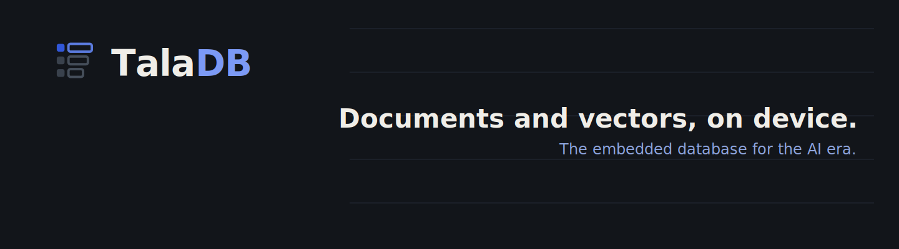

<div align="center">

<!-- Replace with your actual logo file once designed -->


**Local-first document database. Zero cloud. Zero GC. Zero compromise.**

[](https://github.com/thinkgrid-labs/taladb)
[](LICENSE)
[](https://www.rust-lang.org)
[](https://rustwasm.github.io/wasm-bindgen/)
[](https://github.com/thinkgrid-labs/taladb)

</div>

> [!WARNING]
> **TalaDB is under active development.** APIs may change between releases. It is not yet recommended for production use. Follow the [roadmap](#roadmap) to track progress toward a stable release.

---

## What is TalaDB?

TalaDB is an **open-source, local-first document database** built in Rust and designed for the modern JavaScript ecosystem. It gives React and React Native developers a MongoDB-like query API while running entirely on the user's device — no server, no network, no subscriptions.

Under the hood, TalaDB is a three-layer system:

```
┌──────────────────────────────────────────────────────────┐
│  Layer 3 — JS/TS API                                      │
│  wasm-bindgen (browser) · napi-rs (Node.js) · JSI (RN)   │
└──────────────────────────┬───────────────────────────────┘
                           │
┌──────────────────────────▼───────────────────────────────┐
│  Layer 2 — Document Engine  (taladb-core)                 │
│  Document model · Secondary indexes · Query planner       │
└──────────────────────────┬───────────────────────────────┘
                           │
┌──────────────────────────▼───────────────────────────────┐
│  Layer 1 — KV Storage Engine                              │
│  redb (native / Node.js) · OPFS (browser) · IDB fallback │
└──────────────────────────────────────────────────────────┘
```

The **Rust core** compiles to a sub-400 KB WASM bundle for browsers, a native `.node` module for Node.js, and a static library for React Native — the same battle-tested engine everywhere.

---

## Why TalaDB?

|                        | TalaDB  | RxDB       | WatermelonDB | SQLite WASM |
| ---------------------- | ------- | ---------- | ------------ | ----------- |
| **Core language**      | Rust    | JavaScript | JavaScript   | C           |
| **WASM bundle size**   | ~350 KB | ~800 KB+   | N/A          | ~1 MB+      |
| **GC pauses**          | None    | Yes        | Yes          | None        |
| **MongoDB-like API**   | ✅      | ✅         | ❌           | ❌          |
| **React Native (JSI)** | ✅      | Partial    | ✅           | ✅          |
| **TypeScript-first**   | ✅      | ✅         | ✅           | ❌          |
| **Secondary indexes**  | ✅      | ✅         | ✅           | Via SQL     |
| **Open source (MIT)**  | ✅      | Freemium   | ✅           | ✅          |

---

## Features

- **MongoDB-like API** — `find`, `findOne`, `insert`, `update`, `delete` with `$eq`, `$gt`, `$in`, `$and`, `$or`, and more
- **Secondary indexes** — type-safe B-tree indexes with range scan support (`$gte`, `$lte`, `$in`)
- **ACID transactions** — powered by [redb](https://github.com/cberner/redb), a pure-Rust embedded database
- **Local-first** — all data lives on the device; works fully offline
- **Cross-platform** — one API for browser (WASM + OPFS), Node.js (native module), and React Native (JSI)
- **TypeScript generics** — fully typed collections with `db.collection<User>('users')`
- **Schema migrations** — versioned, transactional migrations that run at open time
- **Zero dependencies at runtime** — no cloud, no sync service, no external processes

---

## Quick Start

### Browser (Vite / Next.js)

```ts
import { openDB } from "taladb";

interface User {
  _id?: string;
  name: string;
  email: string;
  age: number;
}

const db = await openDB("myapp.db");
const users = db.collection<User>("users");

// Create an index for fast email lookups
await users.createIndex("email");

// Insert
const id = await users.insert({
  name: "Alice",
  email: "alice@example.com",
  age: 30,
});

// Find
const alice = await users.findOne({ email: "alice@example.com" });

// Range query — uses the index automatically
const adults = await users.find({ age: { $gte: 18 } });

// Complex query
const results = await users.find({
  $and: [
    { age: { $gte: 25, $lte: 40 } },
    { $or: [{ name: "Alice" }, { name: "Bob" }] },
  ],
});

// Update
await users.updateOne(
  { email: "alice@example.com" },
  { $set: { age: 31 }, $inc: { loginCount: 1 } },
);

// Delete
await users.deleteOne({ email: "alice@example.com" });
```

### Node.js

```js
const { TalaDBNode } = require("taladb-node");

const db = TalaDBNode.open("./myapp.db");
const users = db.collection("users");

users.createIndex("email");
const id = users.insert({ name: "Alice", email: "alice@example.com", age: 30 });
const alice = users.findOne({ email: "alice@example.com" });
```

### React Native

```ts
import { TalaDBModule } from "taladb-react-native";
import { openDB } from "taladb";

// In your app entry point (App.tsx / index.js)
await TalaDBModule.initialize("myapp.db");

// Everywhere else — same API as browser
const db = await openDB("myapp.db");
const posts = db.collection<Post>("posts");
```

---

## Filter Reference

| Operator   | Example                               | Description           |
| ---------- | ------------------------------------- | --------------------- |
| (implicit) | `{ age: 30 }`                         | Equality              |
| `$eq`      | `{ age: { $eq: 30 } }`                | Equality              |
| `$ne`      | `{ status: { $ne: 'deleted' } }`      | Not equal             |
| `$gt`      | `{ score: { $gt: 90 } }`              | Greater than          |
| `$gte`     | `{ age: { $gte: 18 } }`               | Greater than or equal |
| `$lt`      | `{ price: { $lt: 100 } }`             | Less than             |
| `$lte`     | `{ age: { $lte: 65 } }`               | Less than or equal    |
| `$in`      | `{ role: { $in: ['admin', 'mod'] } }` | In array              |
| `$nin`     | `{ tag: { $nin: ['spam'] } }`         | Not in array          |
| `$exists`  | `{ avatar: { $exists: true } }`       | Field exists          |
| `$and`     | `{ $and: [{ a: 1 }, { b: 2 }] }`      | Logical AND           |
| `$or`      | `{ $or: [{ a: 1 }, { b: 2 }] }`       | Logical OR            |
| `$not`     | `{ $not: { active: false } }`         | Logical NOT           |

> **Index-accelerated:** `$eq`, `$gt`, `$gte`, `$lt`, `$lte`, and `$in` on indexed fields use an O(log n) B-tree range scan. All other filters fall back to a full collection scan.

---

## Update Reference

| Operator | Example                           | Description              |
| -------- | --------------------------------- | ------------------------ |
| `$set`   | `{ $set: { name: 'Bob' } }`       | Set field values         |
| `$unset` | `{ $unset: { tempField: true } }` | Remove fields            |
| `$inc`   | `{ $inc: { views: 1 } }`          | Increment numeric fields |
| `$push`  | `{ $push: { tags: 'rust' } }`     | Append to array          |
| `$pull`  | `{ $pull: { tags: 'old' } }`      | Remove from array        |

---

## Migrations

```ts
import { openDB } from "taladb";

// Rust side — define migrations in taladb-core (or taladb-react-native/rust)
// JS side — migrations are described and applied at open time

const db = await openDB("myapp.db", {
  migrations: [
    {
      version: 1,
      description: "Add index on users.email",
      up: async (db) => {
        await db.collection("users").createIndex("email");
      },
    },
    {
      version: 2,
      description: "Backfill createdAt for existing users",
      up: async (db) => {
        const users = db.collection("users");
        const all = await users.find({});
        for (const user of all) {
          if (!user.createdAt) {
            await users.updateOne(
              { _id: user._id },
              { $set: { createdAt: Date.now() } },
            );
          }
        }
      },
    },
  ],
});
```

---

## Architecture

### Repository Structure

```
taladb/
├── Cargo.toml                      # Rust workspace
├── pnpm-workspace.yaml             # npm workspace
│
├── packages/
│   ├── taladb-core/                # Pure Rust — no JS bindings
│   │   └── src/
│   │       ├── document.rs         # Value enum, Document struct (ULID IDs)
│   │       ├── engine.rs           # StorageBackend trait + redb implementation
│   │       ├── index.rs            # Secondary index key encoding (type-prefixed)
│   │       ├── collection.rs       # insert / find / update / delete
│   │       ├── migration.rs        # Schema versioning
│   │       └── query/
│   │           ├── filter.rs       # Filter AST
│   │           ├── planner.rs      # Index selection (greedy)
│   │           └── executor.rs     # Scan + post-filter
│   │
│   ├── taladb-wasm/                # Browser (wasm-bindgen + OPFS)
│   ├── taladb-node/                # Node.js (napi-rs native module)
│   ├── taladb-react-native/        # React Native (JSI HostObject)   [planned]
│   └── taladb/                     # Unified TypeScript package
│
└── examples/
    ├── web-vite/                   # React + Vite demo
    ├── expo-app/                   # Expo React Native demo           [planned]
    └── node-script/                # Node.js demo
```

### Secondary Index Design

Index keys are encoded as: `[type_prefix: 1B][encoded_value: NB][ulid: 16B]`

The fixed-width ULID suffix allows unambiguous range scans without delimiters. Type prefixes (`0x20` = Int, `0x40` = Str, etc.) ensure correct cross-type lexicographic ordering in the B-tree.

A query like `age >= 25 && age < 40` translates directly to a single redb range scan:

```
start = [0x20][big_endian(25 ^ sign_bit)][0x00 × 16]
end   = [0x20][big_endian(40 ^ sign_bit)][0x00 × 16]
```

---

## Key Dependencies

| Crate                                                    | Version | Role                                   |
| -------------------------------------------------------- | ------- | -------------------------------------- |
| [redb](https://github.com/cberner/redb)                  | 2.x     | Embedded B-tree KV storage engine      |
| [postcard](https://github.com/jamesmunns/postcard)       | 1.x     | Binary serialization (no_std, compact) |
| [ulid](https://github.com/huxi/rusty_ulid)               | 1.x     | Time-sortable document IDs             |
| [wasm-bindgen](https://github.com/rustwasm/wasm-bindgen) | 0.2.x   | Browser WASM bindings                  |
| [napi-rs](https://napi.rs)                               | 2.x     | Node.js native module bindings         |
| [serde](https://serde.rs)                                | 1.x     | Serialization framework                |
| [thiserror](https://github.com/dtolnay/thiserror)        | 1.x     | Error types                            |

---

## Development

### Prerequisites

- [Rust](https://rustup.rs/) (stable, 1.75+)
- [wasm-pack](https://rustwasm.github.io/wasm-pack/) — for browser builds
- [Node.js](https://nodejs.org/) 18+ and [pnpm](https://pnpm.io/)
- `@napi-rs/cli` — for Node.js native module builds

### Running Tests

```bash
# Rust unit + integration tests (no tooling needed)
cargo test --workspace

# Browser WASM tests (requires Chrome)
wasm-pack test packages/taladb-wasm --headless --chrome

# Node.js tests (after building the native module)
pnpm --filter taladb-node build
pnpm --filter taladb-node test
```

### Building

```bash
# Browser WASM
pnpm --filter taladb-wasm build

# Node.js native module
pnpm --filter taladb-node build

# TypeScript types
pnpm --filter taladb build

# Everything
pnpm build
```

---

## Roadmap

- [x] Core document engine (redb + postcard + ULID)
- [x] Secondary indexes with B-tree range scans
- [x] MongoDB-like filter and update DSL
- [x] Query planner (index selection)
- [x] Schema migrations
- [x] Browser WASM bindings (wasm-bindgen)
- [x] Node.js native module (napi-rs)
- [x] `$or` index union (`IndexOr` plan — all branches must be index-backed)
- [x] Full-text search index (token inverted index, `Filter::Contains`)
- [x] Encryption at rest (`EncryptedBackend` wrapper, AES-GCM-256 via `encryption` feature)
- [x] Live queries / reactive subscriptions (`WatchHandle`, MPSC broadcast)
- [x] OPFS-backed persistent browser storage (snapshot flush on write)
- [x] React Native JSI HostObject (iOS `.mm` + Android Kotlin JNI scaffold)
- [x] Sync adapter interface (`SyncAdapter` trait + `LastWriteWins` implementation)
- [x] CLI dev tools (`taladb inspect`, `export`, `import`, `count`, `drop`)
- [ ] Full OPFS persistence via SharedWorker + `FileSystemSyncAccessHandle`
- [ ] React Native JSI — full C FFI via cbindgen / uniffi
- [ ] Encryption with real AES-GCM (`aes-gcm` + `pbkdf2` crates under `encryption` feature)
- [ ] `$or` index union across different fields (multi-field merge)
- [ ] CLI interactive shell (`taladb shell <file>`)

---

## Contributing

Contributions are welcome! TalaDB is MIT-licensed and fully open source.

1. Fork the repo and create a branch: `git checkout -b feat/my-feature`
2. Make your changes and add tests
3. Run `cargo test --workspace` and ensure all tests pass
4. Open a pull request with a clear description

Please open an issue first for large features or architectural changes.

---

## Contributors

| Name | Contact |
|------|---------|
| Dennis P | [dennis@thinkgrid.dev](mailto:dennis@thinkgrid.dev) |

---

## License

MIT © [thinkgrid-labs](https://github.com/thinkgrid-labs)

See [LICENSE](LICENSE) for the full text.

---

<div align="center">

Built with Rust 🦀 · Designed for the local-first web

</div>
